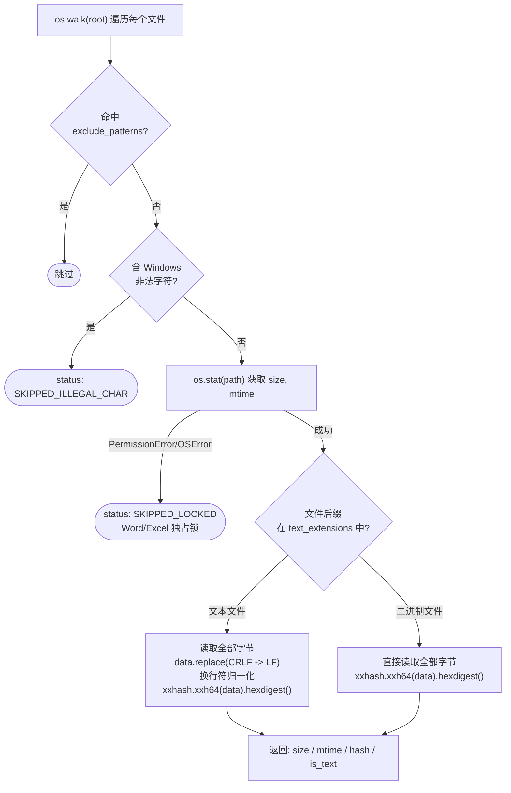
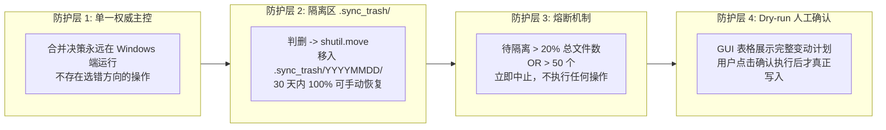

# DuetFlow 完整流程图

> 覆盖：启动 → 配置加载 → GUI 展示 → 扫描 → 三路合并 → 安全检查 → 用户确认 → 执行 → Baseline 更新

---

## 一、 总体主流程（从启动到同步完成）

```mermaid
flowchart TD
    A([用户双击快捷方式 / 运行 gui.py]) --> B

    subgraph STARTUP["① 启动 & 配置加载 · config.py"]
        B{config.yaml\n存在?}
        B -- 不存在 --> C[从 config.example.yaml 复制\n生成空白配置文件]
        C --> C1([弹窗提示: 请先编辑 config.yaml])
        B -- 存在 --> D[yaml.safe_load 读取配置]
        D --> E{~/.ssh/config\n存在?}
        E -- 是 --> F["paramiko.SSHConfig().parse()\n用 host 别名查找:\n  resolved_host\n  resolved_port\n  resolved_user\n  resolved_key"]
        E -- 否 --> G[直接使用 config.yaml 中的\n host / port / user]
        F --> H
        G --> H{resolved_key\n已知?}
        H -- 否 --> I["按序尝试:\n~/.ssh/id_rsa\n~/.ssh/id_ed25519\n~/.ssh/id_ecdsa"]
        H -- 是 --> J
        I --> J[cfg._resolved 填好\n返回 cfg dict]
    end

    J --> K

    subgraph GUI["② GUI 主窗口 · gui.py MainWindow"]
        K[显示连接信息摘要\n如: user@192.168.1.101:22 / id_rsa]
        K --> L([用户点击 '🔍 预览变动' 按钮])
    end

    L --> M

    subgraph SCAN["③ 扫描阶段 · SyncWorker.scan_and_plan() 在 QThread 中运行"]
        M["scanner.scan(win_root)\n本地递归遍历，生成 win_manifest"]
        M --> N["sftp.connect(resolved)\nparamiko SSH 连接 Mac"]
        N --> O["sftp.remote_scan(ssh, mac_root)\n通过 SSH 把 scanner.py 源码发送到 Mac\n远端执行 -> stdout 返回 JSON 清单\n解析为 mac_manifest"]
        O --> P["load_baseline()\n读取 baseline.json.gz\n返回 files dict\n若文件不存在 -> 返回空 {}"]
        P --> Q{baseline\n为空?}
        Q -- 是 --> R["进入冷启动模式\nbaseline = {}"]
        Q -- 否 --> S[正常三路合并模式]
        R --> T
        S --> T
    end

    T --> MERGE

    subgraph MERGE["④ 三路合并引擎 · merge.three_way_merge()"]
        direction TB
        T["收集 all_paths = win ∪ mac ∪ baseline\n逐文件遍历判决"]
        T --> U{文件是否\n被锁定或含非法字符?}
        U -- 是 --> V["SKIP: locked_or_illegal"]
        U -- 否 --> W{baseline\n是否存在该文件?}
        W -- 否冷启动 --> COLD
        W -- 是正常 --> NORMAL

        subgraph COLD["冷启动并集逻辑"]
            direction TB
            CA{Win有?\nMac有?}
            CA -- "仅 Win" --> CB["WIN_TO_MAC"]
            CA -- "仅 Mac" --> CC["MAC_TO_WIN"]
            CA -- "两端都有" --> CD{hash 相同?}
            CD -- 是 --> CE["SKIP: same"]
            CD -- 否 --> CF{Win.mtime\n>= Mac.mtime?}
            CF -- 是 --> CG["WIN_TO_MAC"]
            CF -- 否 --> CH["MAC_TO_WIN"]
        end

        subgraph NORMAL["正常三路合并（7 种状态）"]
            direction TB
            NA["计算:\n  win_changed = win.hash != base.hash\n  mac_changed = mac.hash != base.hash\n  win_deleted = win不存在 & base存在\n  mac_deleted = mac不存在 & base存在"]
            NA --> NB{均未变?}
            NB -- 是 --> NC["① SKIP: unchanged"]
            NB -- 否 --> ND{仅 Win 修改?}
            ND -- 是 --> NE["② WIN_TO_MAC"]
            ND -- 否 --> NF{仅 Mac 修改?}
            NF -- 是 --> NG["③ MAC_TO_WIN"]
            NF -- 否 --> NH{双端均修改?}
            NH -- 是 --> NI["④ CONFLICT\nconflict_name = file_conflict_ts.ext"]
            NH -- 否 --> NJ{"Win删 &\nMac未变?"}
            NJ -- 是 --> NK["⑤ QUARANTINE_MAC\nMac 端也移入隔离区"]
            NJ -- 否 --> NL{"Mac删 &\nWin未变?"}
            NL -- 是 --> NM["⑥ QUARANTINE_WIN\nWin 端移入隔离区"]
            NL -- 否 --> NN["⑦ CONFLICT: modified_vs_deleted\n保留修改版，人工处理"]
        end
    end

    MERGE --> SAFE

    subgraph SAFE["⑤ 安全检查 · trash.circuit_breaker_check()"]
        direction LR
        SA["统计 action_plan 中\nQUARANTINE_WIN + QUARANTINE_MAC 数量"]
        SA --> SB{"待隔离数 > 总文件数×20%\nAND 待隔离数 > 5\nOR 待隔离数 > 50?"}
        SB -- 熔断触发 --> SC(["❌ 弹窗警告并中止\n不执行任何操作"])
        SB -- 正常 --> SD["plan_ready 信号 -> 回传到主线程"]
    end

    SD --> DRYRUN

    subgraph DRYRUN["⑥ Dry-run 展示 & 用户确认 · MainWindow"]
        DA["GUI 表格填充 action_plan\n每行: 动作颜色 | 文件路径 | 备注"]
        DA --> DB["摘要栏: Win->Mac: N | Mac->Win: M | 隔离: K | 冲突: J"]
        DB --> DC{有实质性\n变动?}
        DC -- 无变动 --> DD(["✅ 显示: 双端已是最新状态"])
        DC -- 有变动 --> DE([用户点击 确认执行 按钮])
    end

    DE --> EXEC

    subgraph EXEC["⑦ 执行阶段 · SyncWorker.execute_plan() 在 QThread 中运行"]
        EA["遍历 active_plan\n跳过所有 SKIP 项"]
        EA --> EB{action?}
        EB -- WIN_TO_MAC --> EC["sftp.upload(sftp, local_full, remote_full)\nparamiko SFTP put()"]
        EB -- MAC_TO_WIN --> ED["sftp.download(sftp, remote_full, local_full)\nparamiko SFTP get()"]
        EB -- QUARANTINE_WIN --> EE["trash.quarantine_local(path, win_root)\nshutil.move -> .sync_trash/YYYYMMDD/"]
        EB -- QUARANTINE_MAC --> EF["sftp.remote_quarantine(ssh, remote_path)\nSSH exec: mv 到远端 .sync_trash/"]
        EB -- CONFLICT --> EG{"reason ==\nmodified_vs_deleted?"}
        EG -- 是 --> EH["仅打印日志，跳过\n人工处理"]
        EG -- 否 --> EI["Win 端 copy2 -> file_conflict_ts.ext\nSFTP 拉取 Mac 版本 -> _mac_file_conflict_ts.ext"]
        EC & ED & EE & EF & EH & EI --> EJ[所有文件处理完毕]
    end

    EJ --> FINISH

    subgraph FINISH["⑧ 收尾 · cli.save_baseline() + trash.purge_expired()"]
        FA["save_baseline(win_manifest, mac_manifest)\n合并双端清单 -> 原子写入\n先写 baseline.json.gz.tmp\nos.replace() -> baseline.json.gz"]
        FA --> FB["trash.purge_expired(win_root, 30天)\n遍历 .sync_trash/\n删除 YYYYMMDD 超过 30 天的目录"]
        FB --> FC(["✅ GUI 状态栏: 同步完成！"])
    end
```



---

## 二、 scanner.scan() 文件比对内核（分层短路逻辑）



---

## 三、 sftp.remote_scan() 远端扫描原理

```mermaid
sequenceDiagram
    participant WIN as Windows 主控
    participant SSH as Mac SSH

    WIN->>WIN: 读取 scanner.py 源码文本
    WIN->>WIN: 拼接调用代码<br/>exclude=[...]; text_ext=[...]<br/>result=scan(mac_root, exclude, text_ext)<br/>print(json.dumps(result))
    WIN->>SSH: ssh.exec_command("python3 -c '整段脚本'")
    SSH->>SSH: 在 Mac 本地执行扫描
    SSH-->>WIN: stdout -> JSON 字符串
    WIN->>WIN: json.loads() -> mac_manifest dict
```

> **设计意图**：Mac 端无需预先安装任何 DuetFlow 依赖，只需有 `python3` 和 `xxhash`。整个扫描脚本由 Windows 端实时注入执行。

---

## 四、 关键数据结构速查

```python
# win_manifest / mac_manifest / baseline["files"] —— 同一格式
{
    "src/main.py": {
        "size": 1024,
        "mtime": 1722000000.0,
        "hash": "a1b2c3d4",   # xxhash64，文本文件已 CRLF 归一化
        "is_text": True
    },
    "doc/note.docx": {
        "size": 51200,
        "mtime": 1722000001.0,
        "hash": "e5f6g7h8",
        "is_text": False
    },
    "locked.xlsx": {"status": "SKIPPED_LOCKED"}   # 被 Office 锁住，跳过
}

# action_plan —— merge.three_way_merge() 输出的列表
[
    {"action": "WIN_TO_MAC",     "path": "src/feature.py"},
    {"action": "MAC_TO_WIN",     "path": "doc/readme.md"},
    {"action": "QUARANTINE_WIN", "path": "old/unused.py"},
    {"action": "CONFLICT",       "path": "src/main.py",
                                 "conflict_name": "src/main_conflict_20260728_173000.py"},
    {"action": "SKIP",           "path": "assets/logo.png", "reason": "unchanged"},
]

# baseline.json.gz —— 同步完成后持久化
{
    "version": "2.0",
    "updated_at": "2026-07-28T17:30:00",
    "files": { ...同上格式... }
}
```

---

## 五、 四重防误删防护体系（一图总览）


