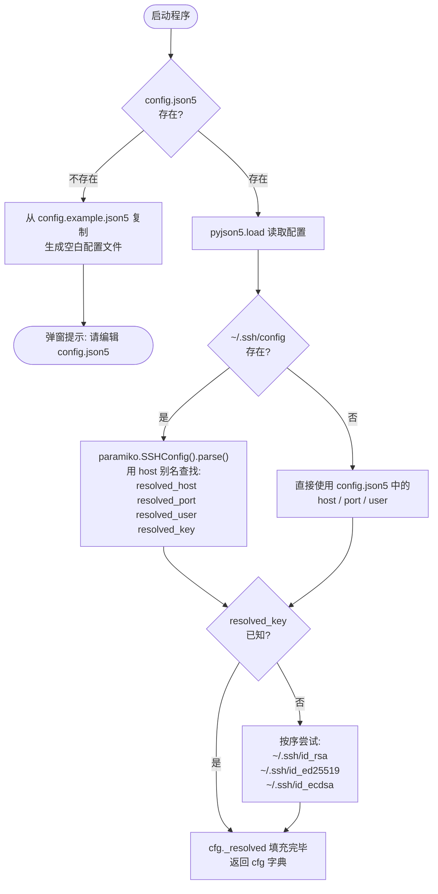

# 01 — 启动与配置加载

系统启动后检查配置文件存在性，解析 SSH 连接参数。

```mermaid
flowchart TD
    launch([启动程序]) --> check_config

    check_config{config.json5\n存在?}
    check_config -- 不存在 --> gen_config[从 config.example.json5 复制\n生成空白配置文件]
    gen_config --> prompt([弹窗提示: 请编辑 config.json5])
    check_config -- 存在 --> parse_cfg[pyjson5.load 读取配置]
    parse_cfg --> check_ssh_cfg{~/.ssh/config\n存在?}
    check_ssh_cfg -- 是 --> resolve_ssh["paramiko.SSHConfig().parse()\n用 host 别名查找:\n  resolved_host\n  resolved_port\n  resolved_user\n  resolved_key"]
    check_ssh_cfg -- 否 --> use_direct[直接使用 config.json5 中的\n host / port / user]
    resolve_ssh --> check_key
    use_direct --> check_key{resolved_key\n已知?}
    check_key -- 否 --> auto_detect_key["按序尝试:\n~/.ssh/id_rsa\n~/.ssh/id_ed25519\n~/.ssh/id_ecdsa"]
    check_key -- 是 --> done
    auto_detect_key --> done[cfg._resolved 填充完毕\n返回 cfg 字典]
```

[返回索引](FLOWCHART.md)

