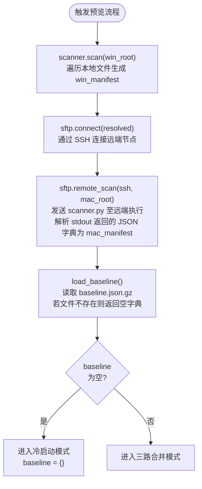
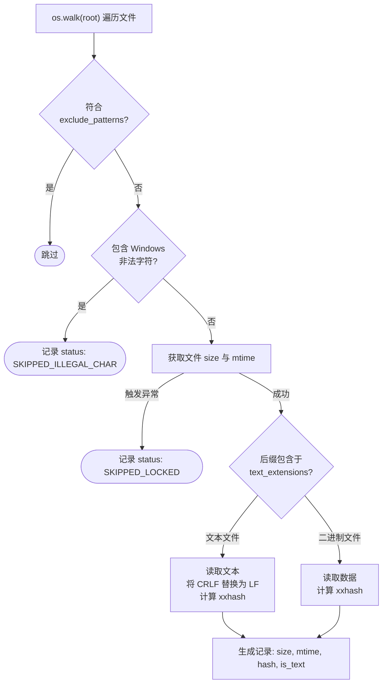
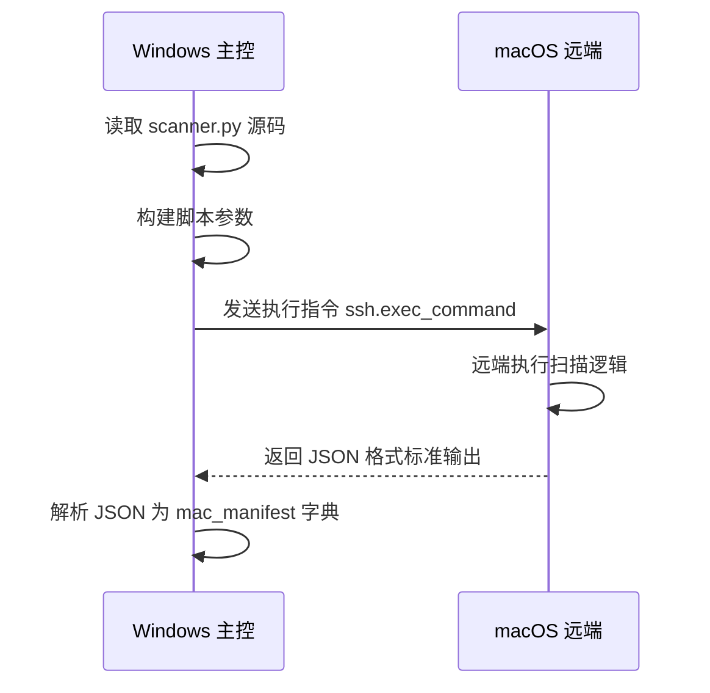

# 02 — 扫描阶段

系统的文件扫描及比对处理流程。

---

## 2.1 扫描流程

```mermaid
flowchart TD
    click_preview([触发预览流程]) --> scan_local
    scan_local["scanner.scan(win_root)\n遍历本地文件生成 win_manifest"]
    scan_local --> connect_remote["sftp.connect(resolved)\n通过 SSH 连接远端节点"]
    scan_remote --> load_baseline["load_baseline()\n读取 baseline.json.gz\n若文件不存在则返回空字典"]
    connect_remote --> scan_remote["sftp.remote_scan(ssh, mac_root)\n发送 scanner.py 至远端执行\n解析 stdout 返回的 JSON 字典为 mac_manifest"]
    load_baseline --> check_baseline{baseline\n为空?}
    check_baseline -- 是 --> cold_start["进入冷启动模式\nbaseline = {}"]
    check_baseline -- 否 --> normal_mode[进入三路合并模式]
```

---

## 2.2 文件扫描计算逻辑 — `scanner.scan()`

```mermaid
flowchart TD
    walk["os.walk(root) 遍历文件"] --> check_exclude{符合\nexclude_patterns?}
    check_exclude -- 是 --> skip([跳过])
    check_exclude -- 否 --> check_illegal{包含 Windows\n非法字符?}
    check_illegal -- 是 --> illegal_char(["记录 status: SKIPPED_ILLEGAL_CHAR"])
    check_illegal -- 否 --> stat_file["获取文件 size 与 mtime"]
    stat_file -- 触发异常 --> locked(["记录 status: SKIPPED_LOCKED"])
    stat_file -- 成功 --> check_text_ext{后缀包含于\ntext_extensions?}
    check_text_ext -- 文本文件 --> normalize_crlf["读取文本\n将 CRLF 替换为 LF\n计算 xxhash"]
    check_text_ext -- 二进制文件 --> hash_binary["读取数据\n计算 xxhash"]
    normalize_crlf --> result["生成记录: size, mtime, hash, is_text"]
    hash_binary --> result
```

---

## 2.3 远端扫描流程 — `sftp.remote_scan()`

扫描脚本通过 SSH 注入远端 Python 进程并执行。

```mermaid
sequenceDiagram
    participant WIN as Windows 主控
    participant SSH as macOS 远端

    WIN->>WIN: 读取 scanner.py 源码
    WIN->>WIN: 构建脚本参数
    WIN->>SSH: 发送执行指令 ssh.exec_command
    SSH->>SSH: 远端执行扫描逻辑
    SSH-->>WIN: 返回 JSON 格式标准输出
    WIN->>WIN: 解析 JSON 为 mac_manifest 字典
```

---

[返回索引](FLOWCHART.md)
