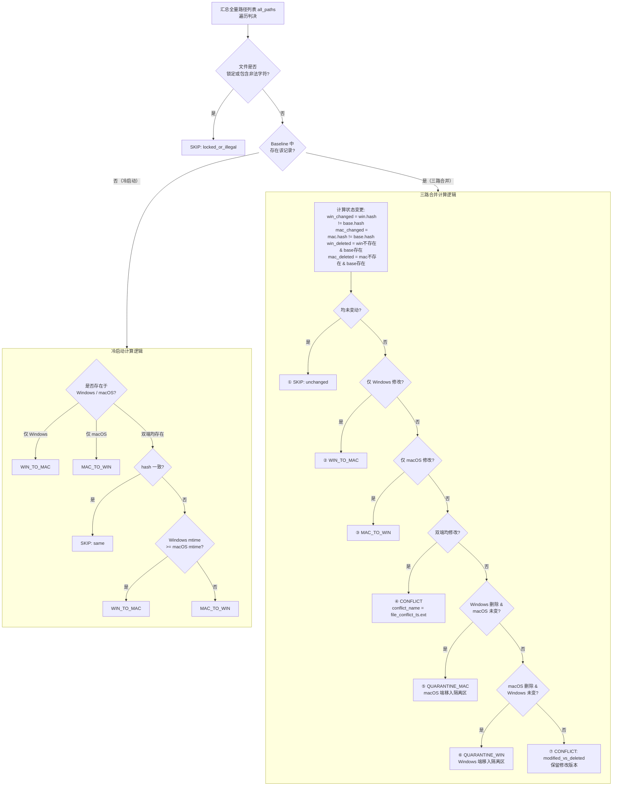

# 03 — 三路合并引擎

三路合并计算函数 `three_way_merge()` 输入 Windows 端清单、macOS 端清单及 Baseline 状态，输出逐文件操作类型。

## 判定结果一览

| 编号 | 判定状态 | 条件说明 | 执行动作 |
|---|------|------|---------|
| ① | `SKIP: unchanged` | 双端文件与 Baseline 一致 | 不处理 |
| ② | `WIN_TO_MAC` | 仅 Windows 端修改 | 上传 Windows 文件至 macOS |
| ③ | `MAC_TO_WIN` | 仅 macOS 端修改 | 从 macOS 下载文件至 Windows |
| ④ | `CONFLICT` | 双端均修改该文件 | 双端各备份冲突文件，跳过覆盖 |
| ⑤ | `QUARANTINE_MAC` | Windows 端删除，macOS 端未变 | macOS 端文件移入隔离区 |
| ⑥ | `QUARANTINE_WIN` | macOS 端删除，Windows 端未变 | Windows 端文件移入隔离区 |
| ⑦ | `CONFLICT: modified_vs_deleted` | 单端删除，另端修改 | 保留修改版文件，不执行删除 |

## 模式比对

| 维度 | 冷启动模式（无 Baseline） | 正常模式（有 Baseline） |
|---|-------------------|---------------------|
| 触发条件 | Baseline 文件不存在 | Baseline 文件正常加载 |
| 判定策略 | 取双端并集，以修改时间确定传输方向 | 基于 Baseline 进行三路比对 |
| 依据 | 文件修改时间 (mtime) | 文件哈希 (hash) |

[返回索引](FLOWCHART.md)

