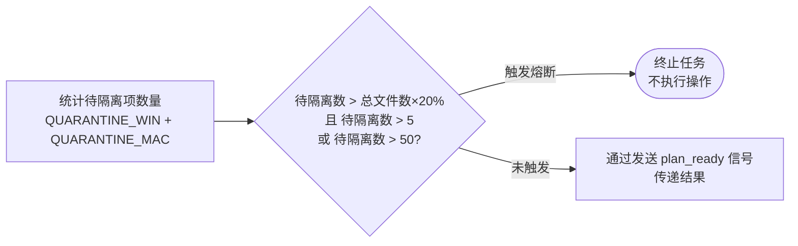
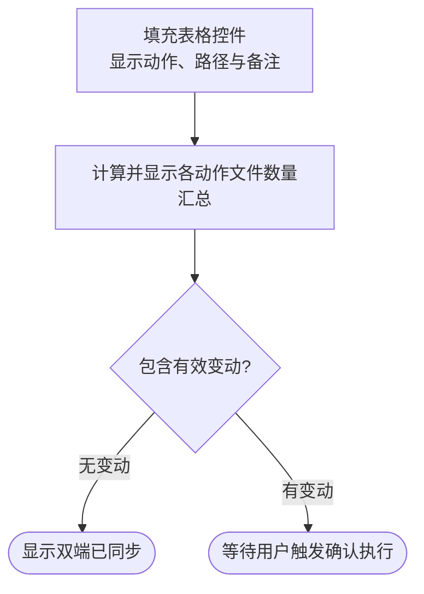
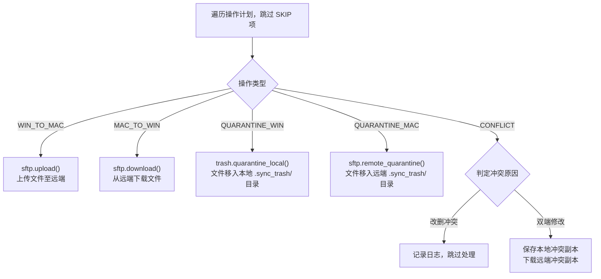
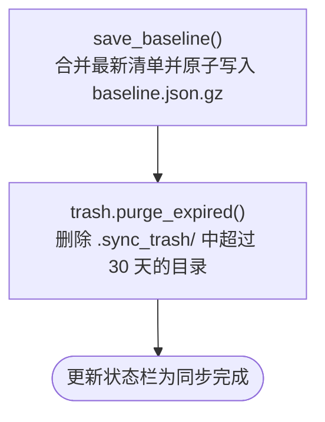

# 04 — 安全检查、Dry-run、执行与收尾

## 4.1 熔断检查

计算完成操作计划后，系统进行熔断校验。

**熔断触发条件**：
- 待隔离文件数超过总文件数 20% 且超过 5 个。
- 待隔离文件数超过 50 个。

---

## 4.2 Dry-run 展示与确认

校验通过后，图形界面展示计划列表。

---

## 4.3 执行阶段

确认后，`SyncWorker.execute_plan()` 顺序执行各类计划项。

---

## 4.4 收尾流程

1. **保存 Baseline**：合并双端最新清单，写入临时文件后执行替换。
2. **清理过期文件**：清除历史隔离区中保存时间超过指定天数的目录。

[返回索引](FLOWCHART.md)

