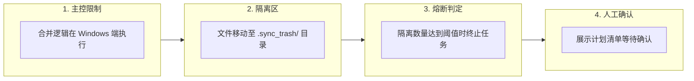

# 05 — 数据结构与防误删体系说明

## 5.1 数据结构

### 文件清单结构

`win_manifest`、`mac_manifest` 及 `baseline["files"]` 使用相同的数据字典结构：

```python
{
    "src/main.py": {
        "size": 1024,            # 文件大小（字节）
        "mtime": 1722000000.0,   # 修改时间戳
        "hash": "a1b2c3d4",      # xxhash64 值
        "is_text": True          # 是否为文本文件
    },
    "doc/note.docx": {
        "size": 51200,
        "mtime": 1722000001.0,
        "hash": "e5f6g7h8",
        "is_text": False
    },
    "locked.xlsx": {
        "status": "SKIPPED_LOCKED"  # 占用跳过
    }
}
```

### 操作计划列表（action_plan）结构

`merge.three_way_merge()` 函数输出的数据结构：

```python
[
    {"action": "WIN_TO_MAC",     "path": "src/feature.py"},
    {"action": "MAC_TO_WIN",     "path": "doc/readme.md"},
    {"action": "QUARANTINE_WIN", "path": "old/unused.py"},
    {"action": "CONFLICT",       "path": "src/main.py",
                                  "conflict_name": "src/main_conflict_20260728_173000.py"},
    {"action": "SKIP",           "path": "assets/logo.png", "reason": "unchanged"},
]
```

### 基线快照（baseline.json.gz）结构

```python
{
    "version": "2.0",
    "updated_at": "2026-07-28T17:30:00",
    "files": { ... }             # 双端文件记录字典
}
```

---

## 5.2 防误删防护体系

防护体系包含 4 层限制机制：



| 层级 | 名称 | 作用说明 |
|------|------|------|
| L1 | 单一主控机制 | 合并判定在 Windows 端统一执行 |
| L2 | 隔离区防护 | 删除指令变更为移动至 `.sync_trash/` 目录 |
| L3 | 熔断机制 | 待隔离数量达到阀值时终止执行 |
| L4 | Dry-run 机制 | 传输前展示变动计划等待确认 |

[返回索引](FLOWCHART.md)

